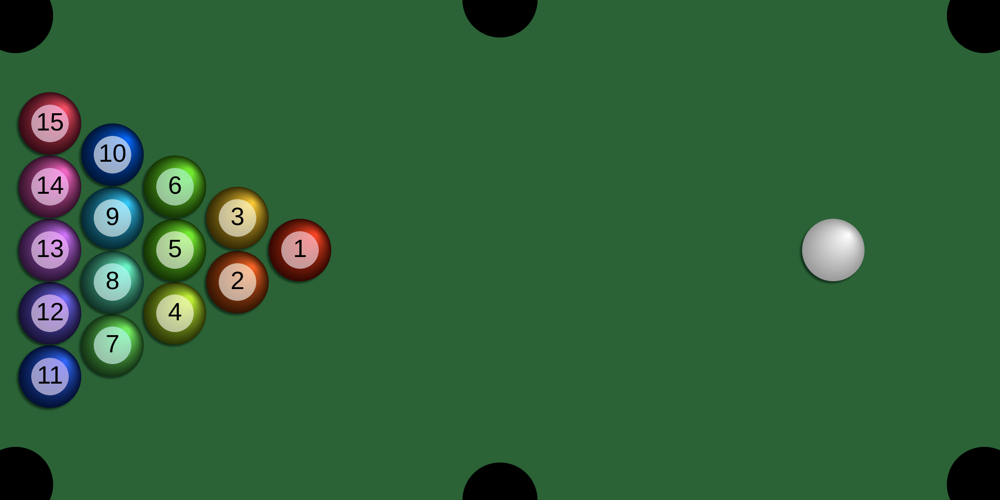

# Pool Game

A JavaScript 2D pool game.
The game is developed using  [Sphere Collision](https://github.com/victorqribeiro/sphereCollision) project.

[]

## About

A simple 2D pool game with no rules.

## How to play / interact

Click / touch on the sphere and drag the mouse / finger to where you want the sphere to go. Faster movement means stronger force.
